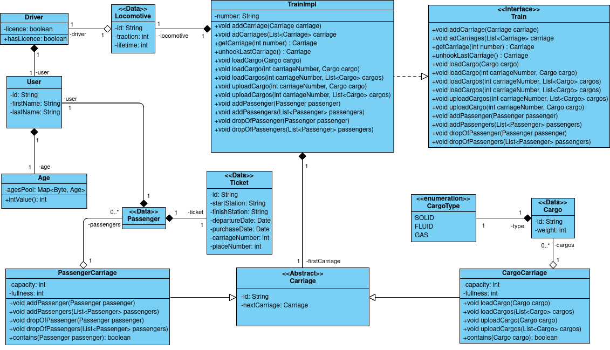

## Домашнее задание к уроку №10

### Задание:

1) Есть сущность Груз (Cargo): number, вес и т. д.
2) Есть User: fistName, lastName, возраст и т. д. 
3) Есть 3 типа вагонов:
    - есть пассажирский вагон: определенное количество мест и туда можно добавлять людей с билетами на соотв место
    - есть грузовой вагон: с грузоподъемностью и возможностью грузить Cargo в пределах грузоподъемности
    - есть локомотив: машинист User (с возрастом > 18 лет и наличием лицензии)
    - есть поезд: номер + сцепленные вагоны (реализовать самостоятельно связным список не используя LinkedList)

  Требуется дизайн классов + тесты, логи, maven. Использовать коллекции.

## Диаграмма классов:

### Выполнил: Манкевич Олег.
